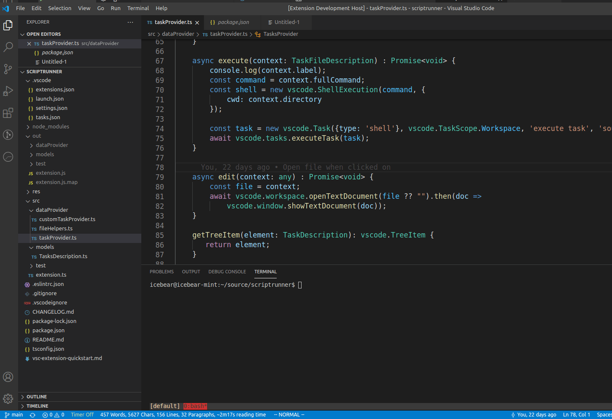
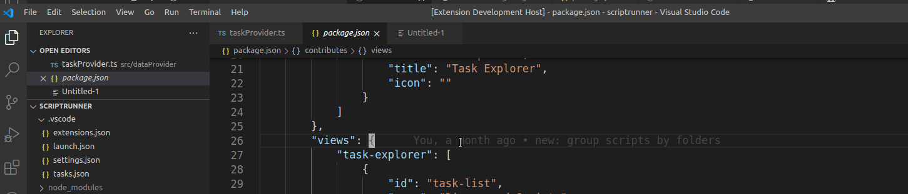

# vstime README

vstime is a VS Code Extension used to provide some simplistic time tracking as you work inside Visual Studio Code
The goal is to make time tracking accessible, right within your editor.
The extension is best for people who spends a lot of time in Visual Studio Code

## Features

* Time Tracking with notes
* Tracking of the current ongoing task
* Ability to Pause
* Detailed breakdown of time spent in different files
* Report of usage

## Configuration
* By going to Settings > Extensions > VS Time, you will see a bunch of configuration
* Available configuration
  * Logfull: On by default, meaning verbose logging including how much time you spent in each file is tracked.  

## How to use
* Ctrl + Shift + P and use the following commands
* Start Tracking
* Pause Tracking
  * You can also pause by clicking the status bar item 
* Resume Tracking
  * You can also resume by clicking the status bar item 
* End Tracking
* Open Logs
  * You can view the raw log from here, the logs are stored at your vscode directory
    * For example, on linux it would be ~/.config/Code/User/globalStorage/swuvsmarket.vstime
* Reset Logs
  * Makes a copy of the current log and clear
  

## Why do I want to try it
Tracking time helps you by:
* Keeping you focused on a single task
* Providing a trail of work habit
* Generating a report for your standup meetings
## Known Issues
* Records are global, which means they are not workspace specific
* Currently there is no roll over, the log file grows indefinitely